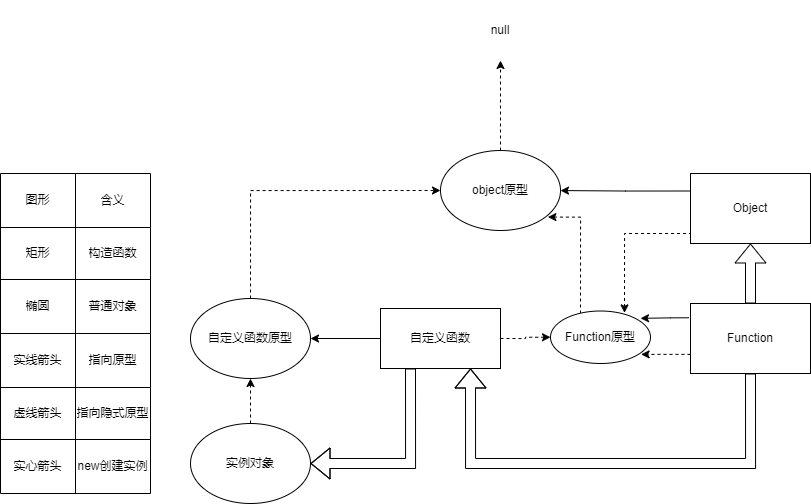

# 构造函数

## 1.简单说明

简单来说，就是用来创建对象的函数。

## 2.如何判断

判断一个函数是否为构造函数，关键在于函数是否通过`new 函数名`的方式被调用。

## 3.与普通函数的区别

虽然普通函数也可以创建并返回对象，但是构造函数可以极大的简化创建返回函数的流程。

```js
# 普通函数创建并返回一个对象。
function user(firstName,lastName){
    return {
        firstName : firstName,
        lastName : lastName,
        fullName : firstName + lastName
    }
}
const user1 = user('张','三');
# 构造函数创建并返回一个对象。
function User(firstName,lastName){
    this.firstName = firstName,
    this.lastName = lastName,
    this.fullName = firstName + lastName
}
const user2 = new User('李','四');
```


从上面的代码可以看见，与普通函数创建返回对象相比，构造函数：

1. 少了返回对象的步骤。

   构造函数内部会自动创建一个新对象，所以默认不单独书写返回对象。

   但如果书写了返回值，如果是原始类型，则直接忽略；如果返回的是引用类型，则使用返回的结果。

2. 函数名采取了大驼峰命名法。（在开发中，推荐函数命名为名词，符合在new这个动词之后使用的语义化开发规范。）

3. 多了this的指向。在构造函数中的this，实际指向构造函数自动创建的新对象，因此可以通过this为构造函数添加属性和方法。

4. 所有的函数，最终都是通过构造函数的形式创建的。

> 补充：
>
> `new.target`
>
> 该表达式在函数中使用，返回的是当前的构造函数，但是，如果该函数不是通过new调用的，则返回undefined
>
> 通常用于判断摸个函数是否是通过new来调用，即判断该函数是否是构造函数。

# 函数的本质

* 函数的本质就是对象，因此函数可以拥有各种属性。

* 所有对象都是通过关键词`new 构造函数`创建出来的。

* 所有的函数，都是通过`new Function`创建出来的，而`Function`是浏览器在开始运行前就通过其他语言创建出来可供使用了。

* JS为了增强原始类型的功能，为`boolen`,`string`,`number`分别创建了一个构造函数，被称为包装类：

  * Boolean
  * String
  * Number

  在语法上，将原始类型当做对象使用时（一般是在使用属性时），JS会自动在该位置利用对应的构造函数，创建对象来访问原始类型的属性。

  类：在JS中，可以认为类就是构造函数。

* 静态属性（方法）、类属性（方法）：表示该属性通过构造函数本身来调用的。

  ```js
  var Hanshu = new Function();
  Hanshu.method = function(param){
  	console.log(param + ',这是一个静态方法或者类方法')
  }
  Hanshu.method('通过构造函数调用') //通过构造函数调用,这是一个静态方法或者类方法
  ```

# 原型和原型链

## 原型 prototype

所有的函数都是一个对象，因此用自己的属性，其中的prototype属性，被称为函数原型。

默认情况下，prototype是一个普通的Object对象。

默认情况下，prototype中有一个属性constructor，它也是一个对象，指向构造函数本身。

```js
var test  = new Function();
console.log(typeof test.prototype) //'object'
console.log(test.prototype.constructor === test) //true 
```

## 隐式原型  

所有的对象都有一个属性：`__proto__`，称之为隐式原型。

默认情况下，对象的隐式原型指向创建该对象的函数原型。

```js
var obj = new Object();
console.log(obj.__proto__ === Object.ptototype) //true
```


当访问一个对象的成员时：

1. 看该对象自身是否有该成员，如果有直接使用
2. 看该对象的隐式原型是否有该成员，如果有直接使用

实例属性（方法）、成员属性（方法）、原型方法：表示该属性通过构造函数创建的对象来调用的，并且是在构造函数的prototype即原型上进行函数声明的。

```js
Object.prototype.method = function(param){
    console.log(param+'，函数在原型上声明，因此被称为实例方法或原型方法。')
}
var obj = new Object();
console.log(obj.__proto__.method('函数在实例的隐式原型上被调用'));//函数在实例的隐式原型上被调用，函数在原型上声明，因此被称为实例方法或原型方法。
//可简写为
console.log(obj.method('函数在实例的原型链上被调用'));//函数在实例的原型链上被调用，函数在原型上声明，因此被称为实例方法或原型方法。

```

## 原型链



