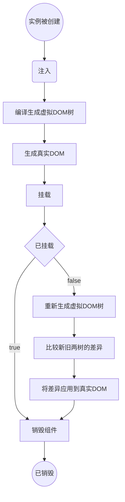

# 流程图绘制

## 使用flow绘制流程图

### 创建流程图

```
```flow
```

### 创建流程: 

`<流程名字>=><关键字>:`+`空格`+`<文字描述> `

### 连接流程：

`<流程名字1>-><流程名字2> `

如果流程的类型为判断，连接流程是需要输入yes 或者 no,如：`<流程名字1>（yes）-><流程名字2> `

> 注意，流程的出现必须要创建流程并且与其他流程有连接才能显示出来。

### 关键词

包括以下几种：

* 开始与结束：`start`， `end ` 

```flow
start=>start: 开始
end=>end: 结束
start->end
```


* 操作：`operation`

  ```flow
  operation1=>operation: 操作1
  operation2=>operation: 操作2
  operation1->operation2
  ```

  

* 子程序： `subroutine`

  ```flow
  main=>operation: 主程序
  fork=>subroutine: 子程序
  main->fork
  ```

  

* 条件： `condition` 

  ```flow
  con=>condition: 条件
  op1=>operation: 操作1
  op2=>operation: 操作2
  con(yes,right)->op1
  con(no,bottom)->op2
  ```

  

* 输入输出：`inputoutput` 

### 实例

用flow流程图写一下生命周期函数

```flow
createInstance=>start: 实例被创建
injection=>inputoutput: 注入
createVnode=>operation: 编译生成虚拟DOM树
createNode=>operation: 生成真实DOM
mount=>operation: 挂载
mounted=>condition: 已挂载
recreateVnode=>operation: 重新生成虚拟DOM树
compare=>operation: 比较新旧两树的差异
recreateNode=>operation: 将差异应用到真实DOM
destroy=>operation: 销毁组件
destroyed=>end: 已销毁
createInstance->injection->createVnode->createNode->mount->mounted
mounted(yes)->destroy->destroyed
mounted(no,left)->recreateVnode->compare->recreateNode->destroy


```

## 使用mermaid graph流程图书写生命周期函数

参考文档：https://www.cnblogs.com/LYinMX/p/13347646.html

### 创建流程图

```
```mermaid
```

### 布局流程图

```
graph TD;//表示从上到下布局
```

### 生成流程图文本框单元

```
名字(输入要显示的文字内容)//生成一个圆角边框文本框
名字((输入要显示的文字内容))//生成一个圆形边框文本框
名字{输入要显示的文字内容}//生成一个菱形边框文本框
名字[输入要显示的文字内容]//生成一个矩形边框的文本框
//输入的文字只需要开始时输入一次，后面用名字就可以表示，不用重复输入文本内容了
```

### 连接流程图

#### 普通单元框连接：

`文本框单元名称1`--> `文本框单元名称2`

#### 判断单元框连接：

* 为真：`文本框单元名称1`+`---true-- `+ `文本框单元名称2`
* 为假：`文本框单元名称1`+`---false-- `+ `文本框单元名称2`
  destroy=>operation: 销毁组件
  destroyed=>end: 

### 实例



